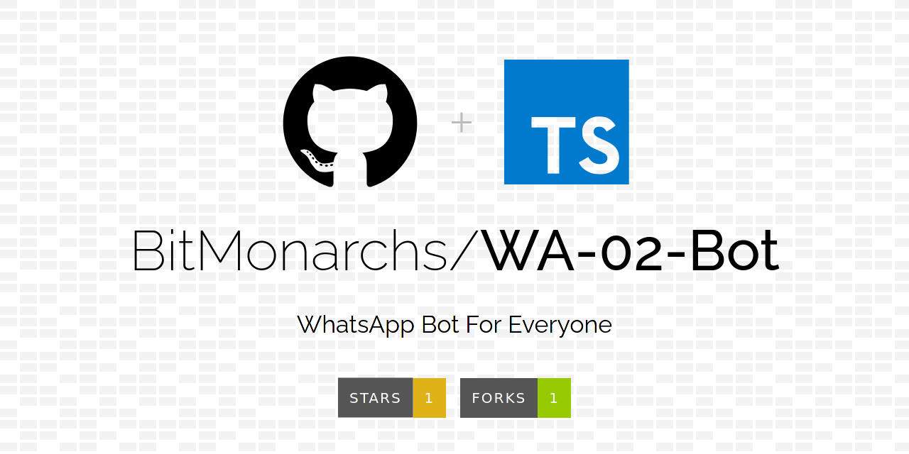

<!-- [](https://vercel.com/new/git/external?repository-url=https%3A%2F%2Fgithub.com%2FPrajjwalDatir%2FthreeJS-PoemDrop&project-name=prajjwal-threejs-poem-drop&repo-name=prajjwal-threejs-poem-drop) -->


[![Contributors][contributors-shield]][contributors-url]
[![Forks][forks-shield]][forks-url]
[![Stargazers][stars-shield]][stars-url]
[![Issues][issues-shield]][issues-url]
[![Mozilla Public License 2.0][license-shield]][license-url]


<!-- PROJECT LOGO -->
<br />
<p align="center">
  <a href="https://github.com/BitMonarchs/WA-02-Bot">
    
  </a>

  <h3 align="center">WhatsApp Zero Two Bot</h3>

  <p align="center">
    WhatsApp Bot For Everyone!
    <br />
    <a href="https://github.com/BitMonarchs/WA-02-Bot"><strong>Explore the docs »</strong></a>
    <br />
    <br />
    <a href="https://github.com/BitMonarchs/WA-02-Bot/issues/new/choose">Report Bug</a>
    <a href="https://github.com/BitMonarchs/WA-02-Bot/issues/new/choose">Request Feature</a>
  </p>
</p>


<!-- TABLE OF CONTENTS -->
<details open="open">
  <summary>Table of Contents</summary>
  <ol>
    <li>
      <a href="#about-the-project">About The Project</a>
      <ul>
        <li><a href="#built-with">Built With</a></li>
      </ul>
    </li>
    <li>
      <a href="#getting-started">Getting Started</a>
      <ul>
        <li><a href="#prerequisites">Prerequisites</a></li>
        <li><a href="#installation">Installation</a></li>
      </ul>
    </li>
    <li><a href="#usage">Usage</a></li>
    <li><a href="#contributing">Contributing</a></li>
    <li><a href="#license">License</a></li>
    <li><a href="#contact">Contact</a></li>
  </ol>
</details>


<!-- ABOUT THE PROJECT -->
## About The Project
<p align="center">

</p>
The Purpose of this WhatsApp Bot is to provide users with useful features for Fun, and <br>To make WhatsApp feature rich for user.

### Built With

Project stack is fairly simple. Typescript & Baileys are the only major things used.
* [Baileys](https://adiwajshing.github.io/Baileys/)
* [TYPESCRIPT](https://www.typescriptlang.org/)
* [NPM](https://www.npmjs.com/)
* [JAVASCRIPT](https://developer.mozilla.org/en-US/docs/Web/JavaScript)

<!-- GETTING STARTED -->
## Getting Started

- You can refer to this video to get started with Typescript.
https://www.youtube.com/watch?v=ahCwqrYpIuM

- You can refer to this video to dive deeper with Typescript
https://www.youtube.com/watch?v=BwuLxPH8IDs


- Also refer to documentation of Baileys here.
https://adiwajshing.github.io/Baileys/


### Prerequisites

To run this project,
You only need npm, git installed on your PC. 


You can install npm via:
* npm
  ```sh
  npm install npm@latest -g
  ```

### Installation

1. Clone the repo
   ```sh
   git clone https://github.com/BitMonarchs/WA-02-Bot.git
   ```
3. Install NPM packages
   ```sh
   cd WA-02-Bot 
   npm install
   ```
4. To run the Application
   ```sh
   npm start
   ```


<!-- USAGE EXAMPLES -->
## Usage

this Poem belongs to BitMonarchs & should only be used as per the Licence

https://github.com/BitMonarchs/WA-02-Bot/blob/main/LICENSE

<!-- CONTRIBUTING -->
## Contributing

### Existing Contributors :
<a href="https://github.com/BitMonarchs/WA-02-Bot/graphs/contributors">
  
</a>

### How to become one of us :
Contributions are what make the open source community such an amazing place to be learn, inspire, and create. Any contributions you make are **greatly appreciated**.

See the [Issues][issues-url] for a list of proposed features (and known [Issues](https://github.com/BitMonarchs/WA-02-Bot/issues) ) to work on.

1. Fork the Project
2. Create your Feature Branch (`git checkout -b feature/AmazingFeature`)
3. Commit your Changes (`git commit -m 'Add some AmazingFeature'`)
4. Push to the Branch (`git push origin feature/AmazingFeature`)
5. Open a Pull Request


<!-- LICENSE -->
## License

Distributed under the Mozilla Public License 2.0. 

See `LICENSE` for more information.

<!-- CONTACT -->
## Contact

[![LinkedIn][linkedin-shield]][linkedin-url]
[![Twitter][twitter-shield]][twitter-url]

Project Link: [https://github.com/BitMonarchs/WA-02-Bot](https://github.com/BitMonarchs/WA-02-Bot)


<!-- MARKDOWN LINKS & IMAGES -->
<!-- https://www.markdownguide.org/basic-syntax/#reference-style-links -->
[contributors-shield]: https://img.shields.io/github/contributors/BitMonarchs/WA-02-Bot.svg?style=for-the-badge
[contributors-url]: https://github.com/BitMonarchs/WA-02-Bot/graphs/contributors
[forks-shield]: https://img.shields.io/github/forks/BitMonarchs/WA-02-Bot.svg?style=for-the-badge
[forks-url]: https://github.com/BitMonarchs/WA-02-Bot/network/members
[stars-shield]: https://img.shields.io/github/stars/BitMonarchs/WA-02-Bot.svg?style=for-the-badge
[stars-url]: https://github.com/PrajjwalDatir/threeJS-PoemDrop/stargazers
[issues-shield]: https://img.shields.io/github/issues/BitMonarchs/WA-02-Bot.svg?style=for-the-badge
[issues-url]: https://github.com/BitMonarchs/WA-02-Bot/issues/new/choose
[license-shield]: https://img.shields.io/github/license/BitMonarchs/WA-02-Bot.svg?style=for-the-badge
[license-url]: https://github.com/BitMonarchs/WA-02-Bot/blob/main/LICENSE
[linkedin-shield]: https://img.shields.io/badge/-LinkedIn-black.svg?style=for-the-badge&logo=linkedin&colorB=555
[linkedin-url]: https://www.linkedin.com/in/datir/
[twitter-shield]: https://img.shields.io/badge/-Twitter-black.svg?style=for-the-badge&logo=linkedin&colorB=555
[twitter-url]: https://twitter.com/prajjwal_datir
